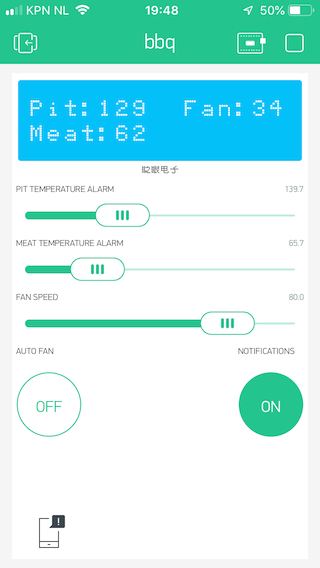

[](https://www.travis-ci.org/rvt/bbq-controller)
[](https://opensource.org/licenses/MIT)

# Design Goal
A small hand-held battery operated BBQ/Smoker temperature controller that can run stand alone with minimal needed configuration to allow for oscillation free temperature control. 

... and it is also be possible to control and monitor over wifi, but that is optional.

Splash Screen :
esp2866 splash Screen


esp32 splash screen


# Featues
A Fuzzy logic based BBQ controller based on Fuzzy Logic with the following features:

* Oled/color display of temperature read out setting of Pit and meat temperature
* Get and Set Fuzzy logic sets configuration without re-compilation
* Store and Load last settings and configuration in SPIFFS for offline controlling your BBQ (no WIFI needed)
* Change temperature setting setpoint with build in menu or over MQTT 
* Ventilator override over MQTT or via menu
* Lid open detection can set a predefined fan speed, or keeps current fan speed (Currently worked upon again)
* Tested with OpenHAB + InfluxDB + Grafana
* Parts of code tested with catch2
* PWM or ON/OFF ventilator control (needs recompile)


# Note

* Connect and test MAX31855 temperature sensor for meat monitor
* Test and implement low charcoal detection
* Test and implement load open detection
* Implement 'stall' detection and alerting [More about stall](https://amazingribs.com/more-technique-and-science/more-cooking-science/understanding-and-beating-barbecue-stall-bane-all)

# Hardware Tests

- Tested on wemos ESP8266 [Wemos® Nodemcu Wifi And ESP8266 NodeMCU + 1.3 Inch OLED](https://www.banggood.com/Wemos-Nodemcu-Wifi-And-ESP8266-NodeMCU-1_3-Inch-OLED-Board-White-p-1160048.html)
- Tested on ttfo_t_display [LiliGO T-Display 1.14" Color Display](https://github.com/Xinyuan-LilyGO/TTGO-T-Display)

# Compilation

``` bash
bbq rvt$ pio run
Processing wemos (platform: espressif8266; framework: arduino; board: esp8285)
-------------------------------------------------------------------------------------------------------------------
Verbose mode can be enabled via `-v, --verbose` option
CONFIGURATION: https://docs.platformio.org/page/boards/espressif8266/esp8285.html
PLATFORM: Espressif 8266 2.3.3 > Generic ESP8285 Module
...
...
...
Retrieving maximum program size .pio/build/wemos/firmware.elf
Checking size .pio/build/wemos/firmware.elf
Advanced Memory Usage is available via "PlatformIO Home > Project Inspect"
RAM:   [=====     ]  48.3% (used 39576 bytes from 81920 bytes)
Flash: [=======   ]  71.7% (used 545976 bytes from 761840 bytes)
========================================== [SUCCESS] Took 10.77 seconds ==========================================
```

To upload to your wemos device run the following command (OSX):
```platformio run --target upload -e wemos --upload-port /dev/cu.SLAB_USBtoUART```

For other compiler options check config.h for other options. When time permits I can make them into more options that can be set of MQTT.

# Configuration

The device will use the know wifi network or it wil present itself as a WIFI accesspoint using
the wifimanager.
Just connect to that accesspoint and open a browser to configure WIFI andf MQTT.

# Run unit tests

* requires cmake to be installed, also assumes you ran ```pio run``` before

``` bash
cd libtest
mkdir build
cmake ../
make
./tests
===============================================================================
All tests passed (118 assertions in 7 test cases)
```

See also [https://travis-ci.org/rvt/bbq-controller](https://travis-ci.org/rvt/bbq-controller)

# MQTT Messages

MQTT is used to change it´s configuration and monitor your BBQ (along side the OLED display if used).

I use [MQTT Spy](https://github.com/eclipse/paho.mqtt-spy/releases)  to spy for messages and use OpenHAB to push the status messages into influxdb. Since the controller only talks to a MQTT message broker, you are free to use any other tools for that, I hear that [Node-RED](https://nodered.org) is pretty cool. Messages are send as key/value pairs to keep things simple.

## Status messages

Topic: ```BBQ/<your device>/status```

Status messages are send to an MQTT broker each time any of the following variables changed. Status messages are great to monitor the progress during cooking.

| name | type  |  Meaning | value  | Unit  | Note |
|---   |---    |---       |---     |---    |---   |
| to   | float | Temperature sensor 1, usually pit temp  | 0..250 | celsius | |
| t2   | float | Temperature sensor 2, usually meat temp  | 0..250 | celsius | |
| sp   | float | Setpoint temperature  | 90..240  | celsius  | |
| f1   | float | Ventilator 1 speed  | 0..100  | % | |
| f1o  | float | Ventilator 1 speed override  | -1..100  | %  | When set > -1 it´s in override mode |
| lo   | bool | Lid Open detection  | 0 or 1  | 1 When lid open is detected  |
| lc   | bool | Low Charcoal detection  | 0 or 1  | 1 When low charcoal is detected |
| ft   | long | Type of fan PWM or OnOff  | 0 or 1  | 0 for PWM 1 for OnOff |

Example message:
```to=130.5 t2=60.2 sp=130.0 f1=25 lo=0 lc=0 f1o=-1 ft=1```

__Note: To switch to JSON outout issue the following MQTT command__

topic: ```BBQ/<your device>/controllerConfig```

value: ```statusJson=B1```


### Config messages

Topic: ```BBQ/<your device>/config```
Topic: ```BBQ/<your device>/config/state``` each time any of the variables are changed the configuration is published to this topic

The controller uses a single topic to configure the behavior.

| name | type  |  Meaning | value  | Default | Unit  | Note |
|---   |---    |---       |---     |---      |---    |---   |
| sp   | float | Set the desired temperature | 90..240 | 30.0 | Celsius |
| lof  | int   | Set a fanspeed when the lid is detected as open | -1..100 | 0 | - | -1 keeps the fan running by control of the controller using it´s current speed |
| ood  | long | On Off fan control duty cycle | 2000..120000 | 30000 | ms | If PWM fan control does not work you can try ON/OFF fan control. See compiler option |
| f1o  | float | Override fan 1 | -1..100 | -1 | % | -1 will set it to auto mode, eg let the controller handle the speed. Any value > -0.5 will be in override |
| fl1  | float,float, float,float | Fuzzy set for Low Fan |  0..100 | 0.0,0.0,0.0,50.0 | % | |
| fm1  | float,float, float,float | Fuzzy set for Medium Fan |  0..100 | 25.0,50.0, 50.0,75.0 | % | |
| fh1  | float,float, float,float | Fuzzy set for High Fan |  0..100 | 50.0,100.0, 100.0,100.0 | % | |
| tel  | float,float, float,float | Fuzzy set for low temperature error |  0-XX | 0.0,10.0 | Celsius | |
| tem  | float,float, float,float | Fuzzy set for medium temperature error |  0-XX | 0.0,15.0, 15.0,30.0 | Celsius | |
| teh  | float,float, float,float | Fuzzy set for high temperature error |  0-XX | 15.0,200.0, 200.0,200.0 | Celsius | |
| tcf  | float,float, float,float | Fuzzy set for temperature drop detection |  0-XX | 10.0,20.0, 20.0,30.0 | Celsius | |
| ft | long | 0 for PWM, 1 for OnOff ventilator type | 0,1 | | |

Example messages to ```BBQ/config```:

* ```sp=130.0``` Set the desired pit temp to 130 degree Celsius
* ```f1o=55``` Override fan speed to 55%
* ```f1o=-1 sp=180.0``` Enable auto mode and set desired temp to 180Celsius in one configuration line

### Setup type of Ventilator

Not all ventilator can be controller well with PWM, this is why we can also use
a On/Off type fan. Default duty cycle is 30 seconds but can be changed with ood command.

topic: ```BBQ/<your device>/controllerConfig```

value: ```fan1Type=L1``` Set type of fan to On/Off

value: ```fan1Type=L0``` Set type of fan to PWM (25Khz for ESP32)

### OnOff type duty cycle

Set´s the duty cycle in ms of the OnOff fan type 15.000 to 30.000 seems to be a good time

topic: ```BBQ/<your device>/controllerConfig```

value: ```fan1DutyCycle=L25000``` (no range checking done, ensure it´s >0 )

### PWM minimal speed

Ventilators controlled by PWM do have an issue that they don´t run very well on lower ranges, or they won´t start up well.
To change the start % issue the following command:

topic: ```BBQ/<your device>/controllerConfig```

value: ```fan1Start=L50``` (no range checking done, ensure it´s >0 and <100)

This means that if the controller range is mapped from 0..100% to PWM range 50%..100%,
thus 1% required results in 50.5% PWM to the fan.

## Setting up temperature sensors

Temperature sensor 1 is always connected to the BBQ Controller but you can select the type of sensor.
Temparature sensor 2 is the sensor to be used as your free probe.

Example: First sensor set as MAX31856 while the other is used for NTC

topic: ```BBQ/<your device>/controllerConfig```

value: ```sensor1Type=L0``` // 0 == MAX31856 1 == MAX31855 2 = NTC

value: ```sensor2Type=L2``` // 0 == MAX31856 1 == MAX31855 2 = NTC

### Setting up NTC sensor

For both sensors we use the steinhart calculations to correct for non-linearity of the NTC sensor.
You can setup R, c1, c2, c3 and the potential offset.

[Temperature-Probe-Cooking](https://www.instructables.com/id/ESP32-NTP-Temperature-Probe-Cooking-Thermometer-Wi/)

topic: ```BBQ/<your device>/controllerConfig```

value: ```NTC1Stein=Sr1=10000, c1=-.0050990868, c2=0.0011737742, c3=-0.0000031896162 o=0``` 

value: ```NTC1Pin=L36``` // Use pin 36 of the esp32 as analog 1 for NTC sensor 1


## Hardware ESP8266 needed (under construction) please ask if you need any clarification!

* Wemos® Nodemcu Wifi And ESP8266 NodeMCU + 1.3 Inch OLED
* Linear 10K Potentiometer
* Push Button
* Thermocouple for meat temperature measurement
* Thermocouple for Pit temperature measurement [RTD Pt100](https://www.banggood.com/RTD-Pt100-Temperature-Sensor-2m-Cable-Probe-98mm-3-Wires-50400Degree-p-923736.html?rmmds=search)
* Sensor module for meat Probe [MAX31855](https://www.adafruit.com/product/269) *There are some fake max31855 modules around without voltage regulator and they have ground issues, be carefull if you go the cheap route.*
* Sensor module for pit (PT100) probe [MAX31865](https://www.adafruit.com/product/3328)
* 5V Ventilator. Around 10..20CFM should be enough for a small to medium drum smoker. 
* Some box to put it all in

THis software is currently configure for using MAX31855 and MAX31865 but it is easy to change that. 
If you need support for that let me know and I will add a configuration or build options for that.

Additional documentation from the official website:

[MAX31865](https://www.maximintegrated.com/en/products/sensors/MAX31865.html)
[MAX31855](https://www.maximintegrated.com/en/products/sensors/MAX31855.html)

## ESP8266 Pin Connection

| ESP Pin | Device pin | Device | Note |
| ---  | ---  | ---    | ---    |
|  0   | -    | Button | Connect the button via pull-up to V3.3 |
|  1   | -    | -      | Unused |
|  2   | CS   | MAX31865 | Chip Select |
|  3   | -    | Mosfet / Transisitor | fan control |
|  4   | SCL  | Wemos connected to the OLED display |
|  5   | SDA  | Wemos connected to the OLED display |
| 12   | SDO  | MAX31865 / MAX31855 | Hardware SPI |
| 13   | SDI  | MAX31865 / MAX31855 | Hardware SPI |
| 14   | CLK  | MAX31865 / MAX31855 | Hardware SPI |
| 15   | CS   | MAX31855 | Chip Select |
| A0   | pot  | Lin 10K Potentiometer middle pin | - |
| 5V   | VCC  | - | Connect to 5V Power supply |
| GND  | DGND | - | Connect to GND of power supply |
| 3.3V | V3.3 | - | Use this to feed the MAX31865, MAX31855 button and potentiometer |

* Connect MAX31865 and MAX31855 to V3.3 Some MAX31855 shields only have 3.3V  and *WILL* break when connected to 5V
* Connect the Lin potentiometer between V3.3 and DGND. Middle pint should go to analog in. The wemos device pin A0 has a build in step-down from 3.3V to 1V
* Connect the button with a 10K pul-up to V3.3 
* To use Fan control use a mos-fet or transistor for PWM fan control. Alternative you can use ON/OF fan control of PWM is not working out (see also compile options to select between the methods). 
* If you notice some noise through the Lin-Potentiometer: add a 0.1uF radiaal Elco between the middle pin and DGND.

MAX31855 is a two wire connection to a k-type thermocouple and has a positive and negative side. Make sure you connect them correctly. I don´ think the device will break if incorrectly connected.
MAX31865 is a 3 or 4 wire connection to a PT100 thermocouple. Read this carefully : [Adafruit 4-Wire RTDs](https://learn.adafruit.com/adafruit-max31865-rtd-pt100-amplifier/rtd-wiring-config) The general idea is that if you have a 3 or 4 wire thermocouple you need
to reconfigure the shield accordingly. When incorrectly connected you won´ break the device but you will get incorrect readings.


*Schematic I can make when somebody asks for it :)*

## Hardware LiliGO T-Display needed (under construction) please ask if you need any clarification!

* [LiliGO T-Display 1.14" Color Display](https://github.com/Xinyuan-LilyGO/TTGO-T-Display)
* Rotary Encoder (as explained [here](https://playground.arduino.cc/Main/RotaryEncoders/) )
* Push Button
* Thermocouple for meat temperature measurement 
* Thermocouple for Pit temperature measurement [RTD Pt100](https://www.banggood.com/RTD-Pt100-Temperature-Sensor-2m-Cable-Probe-98mm-3-Wires-50400Degree-p-923736.html?rmmds=search)
* Sensor module for meat Probe [MAX31855](https://www.adafruit.com/product/269) *There are some fake max31855 modules around without voltage regulator and they have ground issues, be carefull if you go the cheap route.*
* Sensor module for pit (PT100) probe [MAX31865](https://www.adafruit.com/product/3328)
* 12V ballbearing Ventilator. Around 10..20CFM should be enough for a small to medium drum smoker. 
* [TIP120 darlington](https://usa.banggood.com/0-24V-Top-Mosfet-Button-IRF520-MOS-Driver-Control-Module-For-MCU-ARM-Raspberry-Pi-p-1292498.html?utm_source=googleshopping&utm_medium=cpc_organic&gmcCountry=US&utm_content=minha&utm_campaign=minha-usg-pc&currency=USD&cur_warehouse=CN&createTmp=1&utm_source=googleshopping&utm_medium=cpc_bgs&utm_content=frank&utm_campaign=frank-ssc-us-all-1108&ad_id=395572890419) to control fan
* Some box to put it all in

THis software is currently configure for using MAX31855 and MAX31865 but it is easy to change that. 
If you need support for that let me know and I will add a configuration or build options for that.

Additional documentation from the official website:

[MAX31865](https://www.maximintegrated.com/en/products/sensors/MAX31865.html)
[MAX31855](https://www.maximintegrated.com/en/products/sensors/MAX31855.html)

## LiliGO T-Display Pin Connection

| ESP Pin | Device | Note |
| 13   | FAN (via MOSFET)|
| 32   | Button (needs pullup of 10K to 3.3V) |
| 2    | Rotary Pin 1 (might need pullup of 10K to 3.3V) |
| 15   | Rotary Pin 2 (might need pullup of 10K to 3.3V) |
| 33   | Chip Select to MAX31865 |
| 39   | Chip Select ro MAX31855 |
| 27   | SPI SDO Pin to MAX31865 and MAX31855 |
| 26   | SPI SDI Pin to MAX31865 |
| 25   | SPI CLK Pin to MAX31865 and MAX31855 |

| 5V   | Connect to 5V Power supply |
| GND  | Connect to GND of power supply |
| 3.3V | Use this to feed the MAX31865, MAX31855 button and potentiometer |

* Connect MAX31865 and MAX31855 to V3.3 Some MAX31855 shields only have 3.3V  and *WILL* break when connected to 5V
* Connect the rotary Encoder between GND (center pin, and pin 2 and 15)
* Connect the button with a 10K pul-up to V3.3 
* To use Fan control use a mos-fet or transistor for PWM fan control. Alternative you can use ON/OF fan control if PWM is not working out (see also compile options to select between the methods). 

MAX31855 is a two wire connection to a k-type thermocouple and has a positive and negative side. Make sure you connect them correctly. I don´ think the device will break if incorrectly connected.
MAX31865 is a 3 or 4 wire connection to a PT100 thermocouple. Read this carefully : [Adafruit 4-Wire RTDs](https://learn.adafruit.com/adafruit-max31865-rtd-pt100-amplifier/rtd-wiring-config) The general idea is that if you have a 3 or 4 wire thermocouple you need
to reconfigure the shield accordingly. When incorrectly connected you won´ break the device but you will get incorrect readings.


*Schematic I can make when somebody asks for it :)*

## Node-Red Blynk Flow

MVP version will use a node-red flow to communicate with a Blynk application to monitor and control 
basic functionality of your smoker/BBQ and to provide notifications on your cellphone when a important
event happened. The Blynk application has been designed such that you can use the free version so the fact
that it doesn´t ook fancy is just the limitation of the free version. Feel free to expand. The node-red
flow does put out the values to the virtual points
To use Blynk you need to get a free account and get a auth-token you need to fill in to your node-red flow.

### What you need

* Free blynk account [Blynk](https://blynk.io)
* Access to Mosquitto MQTT broker, you could use an free online version MQTT broker or a local version on your rpi 
* Access to nodered. I think there are some onlineversions but you need a few modules installed, not sure if that is possible. I have tested this on my local rpi
* node-red-contrib-string
* node-red-contrib-blynk-ws 
* node-red-dashboard

### Blynk Application you can import



### Node Red Flow
Import the file ```support/nodered-blynk.json``` into a seperate tab then configure your mosquitto node and
your blynk node. It includes a very small dashboard toview values to verify connectiviy. Feel free to make
this a fully working dashboard!
The dashboard can be accesses at : (http://<your IP of node red>:1880/ui/)[http://localhost:1880/ui/]


### Virtual pins usage

| V pin | Direction | Range   | Unit | Param | Usage  |
| ---   | ---       | ---     | ---  | ---   | ---    |
| V0    | In        | 90..240 | C    | -     | Alarm temperature for t1 (pit) |
| V1    | In        | 50..120 | C    | -     | Alarm temperature for t2 (Meat) |
| V2    | In/Out    | 0..100  | %    | f1o   | Fan speed override |
| V3    | In        | 0..1    | bool | -     | When true enable auto fan contol, otherwhise set with V2 value |
| V4    | In        | 0..1    | bool | -     | When true notifications are enabled |
| V5    | Out       | -       | Char | -     | Value to send to LCD display |
| V6    | Out       | 90..240 | C    | sp    | Setpoint |
| V7    | Out       | 90..240 | C    | to    | Pit Temperature    |
| V8    | Out       | 90..240 | C    | t2    | Meat Temperature   |
| V9    | Out       | 0..1    | C    | lo    | Lid Open Detection |


# Credits

* AJ Alves - Fuzzy Logic [eFLL (Embedded Fuzzy Logic Library)](https://github.com/zerokol/eFLL)
* [Adafruit Libraries](https://www.adafruit.com/)
* Knolleary PubSub Client [Pub Sub client](https://pubsubclient.knolleary.net)
* Faster i2c [Brzo i2c](https://github.com/pasko-zh/brzo_i2c/wiki)
* ESP8266 OLED [SSD1306](https://github.com/squix78/esp8266-oled-ssd1306)
* ESP EEPROM helper library [ESP EEPROM](https://github.com/jwrw/ESP_EEPROM)
* PT1000 Library [pt100 rtd](https://github.com/drhaney/pt100rtd)
* Blynk.IO [Blynk](https://blynk.io)
